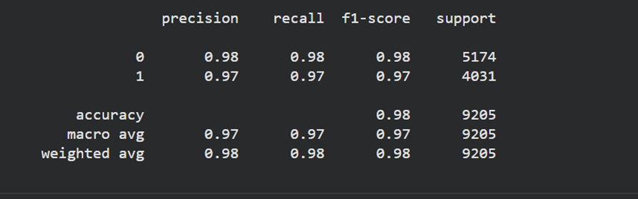
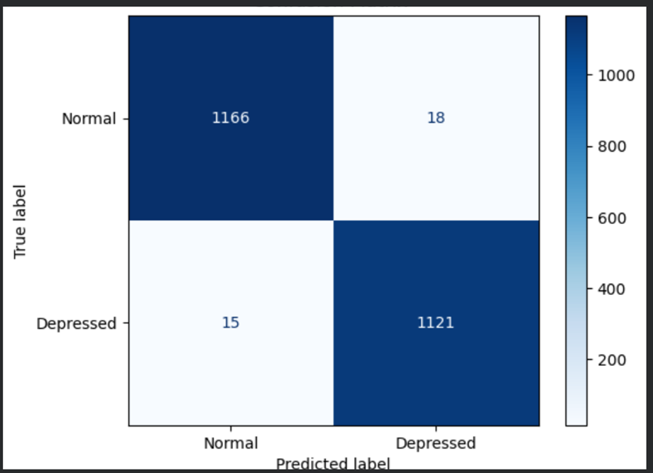

# NeuroChat: Transformer-Based Model for Depression Diagnosis

# Models: MentalBERT & MentalHealth-Gemma

---

## 1. Introduction
## 1.1 Backgournd

Depression is a major global health challenge, yet many people remain undiagnosed due to stigma, limited access to care, and outdated screening tools. Traditional methods like the PHQ-9 often require in-person assessments, making them inaccessible for many users. Advances in AI and NLP, especially transformer models such as BERT and MentalBERT,now provide new opportunities to detect depressive language from everyday text. This project leverages these developments to create a hybrid MentalBERT-powered chatbot that performs private, on-device depression screening while using cloud services only for secure authentication and data management.

## 1.2 Problem Statement
Current mental health screening tools face major limitations in accessibility, cultural sensitivity, and privacy protection. Many widely used tools require in-person assessments, making them inaccessible to individuals in low-resource or remote settings. Existing AI-based screening systems often depend on cloud processing, which raises significant privacy and ethical concerns, especially for sensitive mental-health data. Most importantly, current screening solutions rarely connect users to appropriate support resources, leaving many without immediate help after risk is detected. This highlights the need for a private, accessible, and culturally adaptable AI-driven depression screening system.

## 1.3 Main Obejctive
The primary objective of this project is to develop an AI-powered chatbot for depression diagnosis and mitigation using a fine-tuned MentalBERT model. The system aims to provide accurate on-device depression screening.Through privacy-preserving inference and context-sensitive support, the chatbot enhances accessibility, confidentiality, and relevance in mental health assistance.

## Justification
This project addresses critical gaps in mental health screening by developing a bias-aware chatbot that performs all analysis locally, eliminating privacy risks and increasing user trust.It also transforms simple detection into actionable support by connecting users to relevant mental health resources in real time.

---

## 2. Approach

### 2.1 Data Processing

 Three English textual datasets from Hugging Face were used:
  1. **Ziq/depression_tweet** (~46,000 short social media posts; labels: 0 = Normal, 1 = Depressed)
  2. **hugginglearners/reddit_depression** (7,731 Reddit posts; cleaned; labels: 0/1)
  3. **mangoesai/DepressionDetection** (7,731 pre-cleaned entries; labels: 0/1)
- Datasets varied in length, style, and domain; collectively improved classifier robustness
- Checked for duplicates/missing data; labels renamed `labels` for Hugging Face Trainer
- Features: raw text posts; Labels: Normal or Depressed
- Tokenized with MentalBERT tokenizer (produces token IDs, attention masks)

### 2.2 Data Splitting

- Train / Validation / Test split: 70% / 15% / 15%
- Stratified sampling to maintain Normal/Depressed proportions
- Ensured unbiased learning and reliable evaluation

### 2.3 Feature Preparation

- Features: text posts and tweets
- Labels: Normal or Depressed
- Tokenization with MentalBERT tokenizer:
- Produces token IDs, attention masks, and other transformer-ready representations
- No additional label encoding required

### 2.4 Text Cleaning

- Lowercasing
- Removal of URLs, emojis, mentions, hashtags, HTML tags
- Removal of excessive punctuation
- Whitespace normalization
- Removal of non-ASCII characters

Outcome:
- Consistent, structured text suitable for transformer input
- Ready for MentalBERT model training and inference

---

## 3. Model Architecture

### MentalBERT
- 12-layer Transformer Encoder
- Hidden size: 768
- 12 attention heads
- Max sequence length: 128 tokens
- Classification head added for binary prediction
- Specialised for mental-health linguistic patterns

### MentalHealth Gemma
- Lightweight transformer adapted for mental-health dialogue
- Instruction-tuned for conversational screening
- Supports context-aware responses
- Improves generalisation across varied user inputs
- Does **not** perform classification

### Training Configuration (MentalBERT)
- Loss: Cross-Entropy
- Optimizer: AdamW (lr=2e-5)
- Batch size adapted for CPU/GPU
- Mixed precision where possible
- Gradient accumulation for low-memory environments
- Early stopping (patience=3)
- Scheduler with warm-up steps

Objective:
- Binary classification: 0 = Non-Depressed, 1 = Depressed

---

## 4. Evaluation Metrics

Metrics used:
- Accuracy
- Precision
- Recall
- F1-Score

### Confusion Matrix

Interpretation:
- High TP (1121): Most depressed cases are correctly identified, reducing missed depression cases.
- Low FP (18): Few non-depressed cases are incorrectly flagged as depressed, minimizing false alarms.
- Low FN (15): Only a small number of depressed cases are missed.
- Balanced FN/FP: Indicates the model is reliable and generalisable across both classes.

---

## 5. Results Summary

### MentalBERT (Classification)
- **Accuracy:** 0.986
- **Precision (Depressed Class):** 0.984
- **Recall (Depressed Class):** 0.987
- **F1-Score (Depressed Class):** 0.986

**Observations:**
- Excels on mental-health specific datasets
- Stable performance without apparent overfitting
- Effectively reduces missed depression cases

### Gemma MentalHealth (Conversational Logic)
- Role: Provides dialogue management and context-aware responses
- Enhances natural conversational flow
- Improves generalisation across user input variations
- Metrics like accuracy/precision/recall not applicable

Observations:
- Supports MentalBERT by guiding user interaction
- Maintains coherent and contextually relevant responses
- Improves overall user engagement and system reliability

---

## 6. Key Findings

### Strengths
- High accuracy in detecting depressive language (MentalBERT)
- Robust to noisy text (MentalBERT)
- Deep contextual understanding (MentalBERT)
- Gemma: enhances conversational flow and generalisation across varied inputs

### Weaknesses
- High computational requirements (both models)
- Short inputs may reduce MentalBERT performance
- Sensitive to unseen slang (MentalBERT)
- Transformer inference heavier than classical ML models

## 7. Challenges Faced

### Data-Related Challenges

**Challenge 1: Access to Clinically Relevant Data**
- **Issue:** Significant difficulty and restrictions in obtaining access to gold-standard clinical datasets, such as **DAIC WOZ**, **CLPsych** and data labelled strictly according to the **DSM-5** criteria.
- **Impact:** Limited the model's exposure to diverse, verified clinical examples, potentially biasing performance toward non-clinical data sources.

**Challenge 2: Inconsistent Dataset Labels**
- **Issue:** Datasets were sourced from heterogeneous sources with differing formats and labelling schemes.
- **Impact:** Required extensive data cleaning and harmonisation efforts before training could begin.

**Challenge 3: Noisy and Informal Text**
- **Issue:** The textual data contained informal language, including sarcasm, slang, and typos.
- **Impact:** Increased misclassification risk; necessitated the use of data augmentation techniques and robust pre-processing.

### Model-Related Challenges

**BERT Memory Constraints**
- High RAM/GPU usage
- Restricts batch size; training slower
- Solution: Gradient accumulation

**Early Stopping Tuning**
- Risk of underfitting
- Required manual adjustment of patience/thresholds

**Gemma Integration**
- Maintaining real-time conversational responses requires optimisation
- Trade-off between latency and contextual accuracy

### Hardware Constraints

**Challenge: Lack of Dedicated GPU Resources**
- **Issue:** Training and, critically, **inference** were constrained by the **lack of high-performance GPU hardware**.
- **Impact:** Resulted in **significantly longer training times** and **slow inference speed**, requiring careful batch optimisation and limiting the size and complexity of models that could be deployed efficiently.

---

## 8. Production Improvements
- ## 8. Production Improvements

- **Train using clinically validated datasets** (e.g., DAIC-WOZ, CLPsych, eRisk) to improve diagnostic reliability and clinical relevance.  
- **Implement a low-confidence flagging system** that alerts users when model confidence drops below a threshold and recommends follow-up actions.  
- **Deploy on GPU-supported infrastructure** to significantly reduce inference time and improve real-time responsiveness.  
- **Expand multilingual and culturally adaptive training** to further reduce bias and improve screening accuracy across diverse user groups.  
- **Introduce model quantization and optimization** for faster on-device inference, especially on low-power devices.  
- **Add continuous learning and model monitoring** to maintain long-term performance as language patterns evolve.
- **Uncertainty Flagging System:**: Develop a system to flag predictions where MentalBERT's confidence is low.
